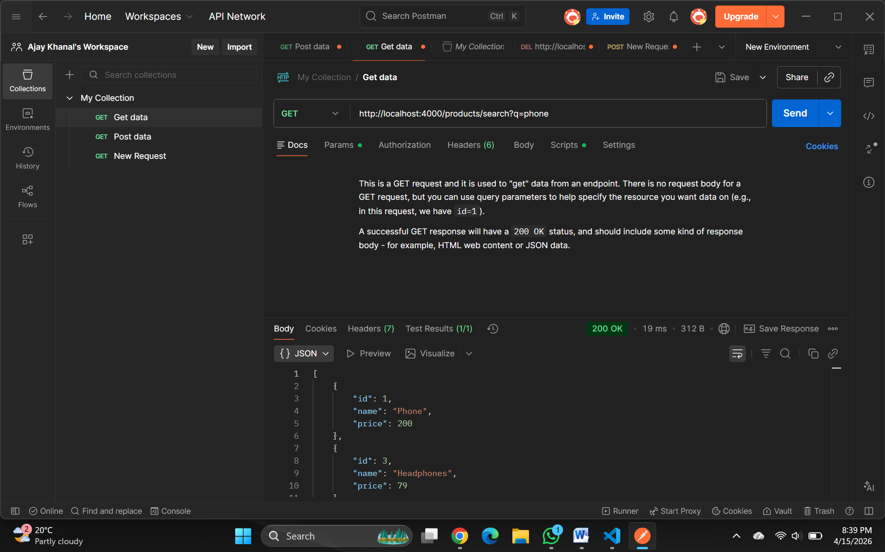

# Express.js Route Order Issue: `/products/search` returning 404

## Problem Description

When making a GET request to `/products/search?q=phone`, the API returns a `404 Not Found` error with "Product not found" message, even though the search route is properly defined.

## Root Cause

The issue occurs when a dynamic route parameter (e.g., `/:id`) is defined **before** a specific route path (e.g., `/search`). Express.js matches routes in the order they are defined. When `/products/:id` comes first, Express interprets `"search"` as an `id` parameter value instead of a path segment.

### ❌ Incorrect Route Order

```javascript
// This catches EVERYTHING after /products/
app.get('/products/:id', (req, res) => {
  const product = products.find(p => p.id === parseInt(req.params.id));
  if (!product) {
    return res.status(404).send('Product not found');
  }
  res.json(product);
});

// This route will NEVER be reached because /products/search 
// is already captured by /products/:id (where id = "search")
app.get('/products/search', (req, res) => {
  const query = req.query.q;
  const results = products.filter(p => 
    p.name.toLowerCase().includes(query.toLowerCase())
  );
  res.json(results);
});

